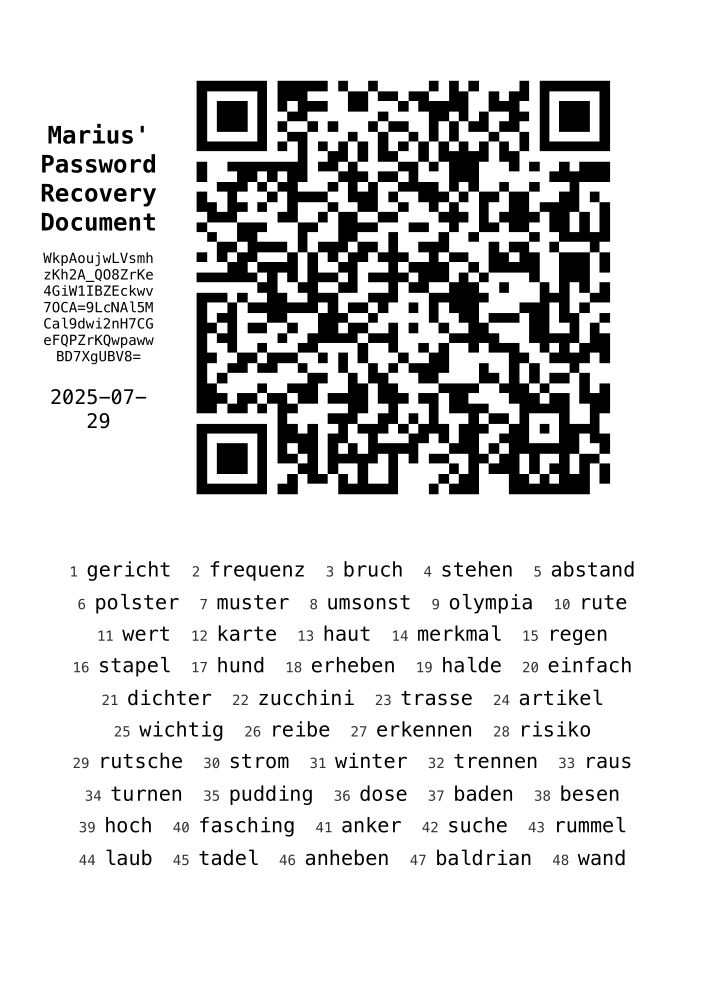
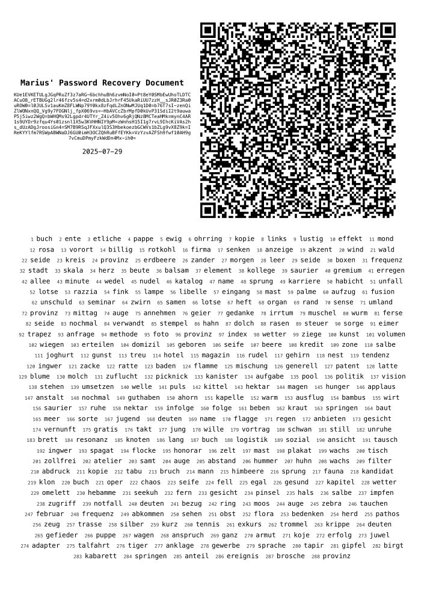

# Shamir's Secret Sharing Tool

This tool splits a secret into several shares using the SSS implementation by
[SSSaaS/sssa-golang](https://github.com/SSSaaS/sssa-golang). It outputs a html
file that can be printed. Each share is printed as base64 text, as qr code of
that base64 text, and as a sequence of words. Recovery works using the base64
text or sequence of words.

## Caveats

I developed this for me and didn't bring it up to any standards. Also the words
are in German, but you could replace the list by any other list of 2048 words
(search for BIP39 or Diceware). I used AI to get the project done quickly, so if
you use this project and your security gets compromised, I'll blame it on the AI
uprising.

## Commands

Generate 5 share of which 3 are required (prompts for secret):

    go run ./... encode 3 5

The html page is written to the output directory.

Recover (prompts for shares):

    go run ./... decode

If you want to test this:

    go run ./... encode 3 5 > shares.txt
    go run ./... decode < shares.txt

## Example

This how a short secret can look if printed on a A5 page:

It isn't so nice anymore for longer secrets (180 ascii chars):

## License

[MIT](./LICENSE), except files in binarywords/dys2p which are not mine and come
with [their own license](./binarywords/dys2p/wordlists-de/LICENSE).
